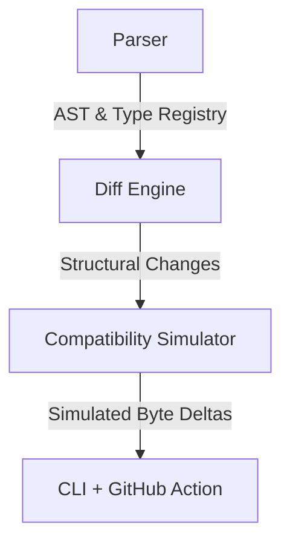

# EPIC

<p align="center">
  <b>Upgrade Intelligence for Solana</b>
</p>

<p align="center">
  <a href="https://www.npmjs.com/package/@solana-epic/cli"></a>
  <a href="LICENSE"></a>
</p>

---

## The Problem

**Your Solana upgrade compiled successfully.**

**Tests pass.**

**Audits pass.**

**It is still about to corrupt every existing account.**

A minor type shift, field reordering, or missing state reload can corrupt deserialization layouts, lock user funds, and introduce severe security regressions. When you deploy a program upgrade on Solana, it is a high-risk migration. 

---

## The Solution

Deploy with certainty. 

EPIC acts as the deployment safety layer for Solana. Before you merge a pull request or deploy to mainnet, EPIC analyzes your state layout evolution, ABI compatibility, and security lifecycle.

```bash
$ epic check ./old-program ./new-program

━━━━━━━━━━━━━━━━━━━━━━━━━━━━━━━━━━━━━━━━━━━━━━━━━━━━
EPIC ACCOUNT COMPATIBILITY
━━━━━━━━━━━━━━━━━━━━━━━━━━━━━━━━━━━━━━━━━━━━━━━━━━━━

Program        Position
Accounts       1
Verdict        [ BLOCKED ]  Existing accounts would be corrupted
Breakdown      1 blocked  ·  0 migration  ·  0 safe

──────────────────────────────────────────────────

[ BLOCKED ]  Position  ·  Existing accounts would be corrupted

Size        40 → 48 bytes (+8)
Certainty   Exact

WHY
• Field inserted in the middle — every field after the insertion point
shifts on disk.

Old Layout                    New Layout
  owner  8–39            → amount  8–15          
                         → owner  16–47          

WHAT BREAKS
Bytes 8–39 previously held `owner: Pubkey`. Under the new layout those
same bytes deserialize as `amount: u64`. Existing on-chain accounts will
silently decode into the wrong fields.

RECOMMENDED UPGRADE PLAN
  1. DO NOT deploy over existing `Position` accounts — a field was inserted
     before the end, shifting every later field.
  2. Keep the persisted layout backward-compatible (append fields at the
     tail; never reorder, remove, retype, or shrink in place).
  3. If the new shape is required, introduce a versioned account (new
     discriminator) and migrate state explicitly into it.
```

---

## Why EPIC Exists

**Compiler**  
Ensures your syntax is correct and types align.

↓

**Security Scanners**  
Ensures your code doesn't contain known vulnerabilities.

↓

**EPIC**  
Ensures the transition between your old on-chain deployment and your new code will not break live state.

↓

**Deployment**

EPIC verifies upgrade compatibility, answering a simple question before you ever sign a transaction: *"Can I safely deploy this?"*

---

## Core Capabilities

- **Compatibility Analysis**: Compare two program versions to verify layout compatibility and prevent state corruption.
- **Security Audit**: Verify that modifications to instruction state rules and safety invariants do not introduce regressions.
- **Workspace Analysis**: Track account layout evolution, serialized sizes, and memory offsets to manage state scaling.
- **Environment Diagnostics**: Automatically verify host prerequisites and workspace configurations.
- **GitHub Action**: Automate upgrade intelligence checks natively in your CI pipeline.

---

## Installation

Install the EPIC CLI globally via npm:

```bash
npm install -g @solana-epic/cli
```

Verify your installation:

```bash
epic --version
```

---

## Quick Start

Check compatibility between two versions of your Anchor program:

```bash
epic check path/to/v1 path/to/v2
```

Audit your current workspace:

```bash
epic audit ./my-project
```

Analyze the state layouts of a program:

```bash
epic analyze ./my-project
```

---

## Upgrade Verdicts

EPIC classifies every state layout modification into actionable verdicts:

### SAFE
The new layout is identical to the old layout. It is 100% safe to deploy.

### MIGRATION REQUIRED
You appended a new field to the end of the struct. This does not shift existing fields, but you must ensure that your program correctly initializes the new field or handles `Realloc` properly for existing on-chain data.

### BLOCKED
You deleted a field, reordered fields, or changed a data type in place. This shifts bytes on disk. If deployed, existing accounts will silently deserialize the wrong memory, corrupting your application. 

---

## GitHub Action Integration

Integrate EPIC into your CI pipeline using the official GitHub Action. It automatically blocks pull requests that would corrupt mainnet state and comments with a beautiful markdown report.

Add the following to `.github/workflows/epic.yml`:

```yaml
name: EPIC Upgrade Guard
on:
  pull_request:
    branches: [ main ]

jobs:
  check-upgrade:
    runs-on: ubuntu-latest
    steps:
      - name: Checkout Old Version
        uses: actions/checkout@v4
        with:
          ref: main
          path: old

      - name: Checkout New Version
        uses: actions/checkout@v4
        with:
          path: new

      - name: EPIC Upgrade Check
        uses: solana-epic/epic@v0.2.0-beta.0
        with:
          github_token: ${{ secrets.GITHUB_TOKEN }}
          old_path: ./old
          new_path: ./new
          fail_on_severity: Critical
```

---

## Architecture

EPIC is built around a rigorous data extraction and simulation pipeline:



1. **Parser**: Extracts an exact layout topology of every account and state type using Rust AST analysis.
2. **Diff Engine**: Analyzes structural changes across versions.
3. **Compatibility Simulator**: Calculates byte shifts, serialization impact, and deterministically models exactly how the new struct will behave on disk.
4. **CLI / Action**: Translates findings into human-readable safety intelligence.

---

## Roadmap

Upcoming milestones:

- **v0.3.0**: Dynamic `Vec`/`String` resizing checks and PDA derivation tracking.
- **v0.4.0**: Automatic zero-downtime migration script generation.
- **v1.0.0**: Stable API, extensive protocol support, and advanced simulation integrations.

---

## Contributing

We welcome contributions! Please see our issue tracker for open issues or submit a pull request. Make sure you run `epic doctor` to verify your environment setup before building.

---

## License

This project is licensed under the MIT License.
