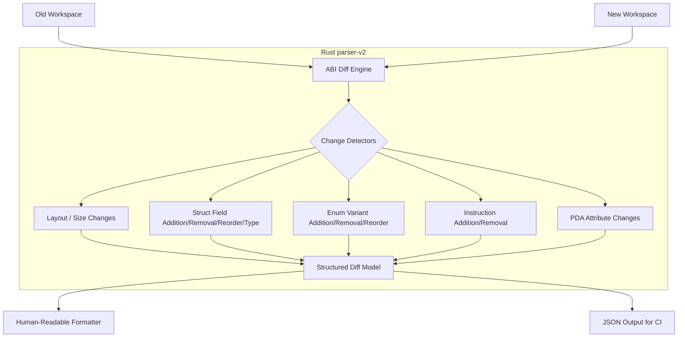

# ABI Intelligence Implementation Plan

## 1. Repository Audit: What Already Exists

The `parser-v2` package is a Rust-based parser that replaces the regex-based `parser` (V1) package. Here is the breakdown of existing structures:

*   **`packages/parser-v2/src/types.rs`**: Defines AST representation models:
    *   `TypeDef`: Enum representing `Struct(StructDef)`, `Enum(EnumDef)`, or `Alias(AliasDef)`.
    *   `TypeRef`: Enum for primitives (`u8`, `u64`, etc.), arrays, vectors, options, strings, pubkeys, custom/resolved paths, etc.
    *   `TypeRegistry`: Global map mapping absolute paths (`String`) to `TypeDef`.
*   **`packages/parser-v2/src/workspace.rs`**:
    *   Parses Rust files using `syn` and a `FileVisitor` which implements `syn::visit::Visit`.
    *   Extracts structural definitions and registers them in the `TypeRegistry`.
*   **`packages/parser-v2/src/layout.rs`**:
    *   `LayoutEngine`: Recursively computes exact Borsh serialization sizes.
    *   Successfully handles primitives, enums (1 byte discriminator + max variant size), options, structs, and arrays.
*   **`packages/parser-v2/src/abi.rs`**:
    *   `AbiEngine`: Computes recursive SHA-256 cryptographic fingerprints of types.
*   **`packages/parser-v2/tests/abi_tests.rs`**:
    *   Verifies fingerprint changes for field reorders, additions, removals, type changes, nested structs, and enums.

---

## 2. What is Missing

To achieve full Phase 2 ABI Intelligence, the following features are missing:

1.  **Diff Engine**: No Rust-based diffing algorithm exists. The V1 diff engine resides in `packages/parser/src/diff.ts` and is regex/TS-bound.
2.  **Structured Diff Model**: The diff results (representing changes, severity, description, etc.) must be defined in Rust.
3.  **Instruction Extraction**: `parser-v2` currently ignores instruction functions (methods in `#[program]` modules).
4.  **Field Attributes / PDA Parsing**: Field attributes (like `#[account(init, seeds = ...)]` which define PDA derivation constraints) are discarded during AST parsing.
5.  **Human-Readable Formatter**: Logic to print structured results in the user's requested text format is missing.
6.  **Comprehensive Unit Tests**: Rust tests specifically asserting diff detection and severity mapping.

---

## 3. Assumptions vs. Current Codebase

| User Assumption | Codebase Reality | Status / Alignment |
| :--- | :--- | :--- |
| **Parser V2 already exists** | Present in `packages/parser-v2`. | **Matches** |
| **Uses Rust `syn`** | Built on top of `syn` 2.0. | **Matches** |
| **Workspace graph generation implemented** | Built via `TypeRegistry`. | **Matches** |
| **Instruction additions/removals** | Ignored by `FileVisitor`. | **Missing - Must be added to parser** |
| **PDA/account definition changes** | Attributes like `#[account(...)]` are discarded. | **Missing - Must be added to parser** |

---

## 4. Cleanest Architecture for ABI Intelligence

To keep the codebase maintainable, mathematically sound, and performant, we will structure the ABI Intelligence directly inside `packages/parser-v2`:

### Key Design Details:
1.  **Field Attributes Capture**: Extend `FieldDef` to store a vector of field attributes (`attrs: Vec<String>`). If a seed or space value in `#[account(...)]` is modified, the attribute diff will flag it as a `PdaAccountDefinitionChange`.
2.  **Instruction Capture**: Add a `TypeDef::Instruction(InstructionDef)` variant. Extend `FileVisitor`'s `visit_item_mod` to parse functions within modules marked with `#[program]`.
3.  **Recursion-Safe Diffing**: Graph keys (absolute paths) from both workspaces are compared. If both have the key, we recursively compare the definition.
4.  **Output & Formatting**: Implement `Display` or format functions to generate the user-requested CLI alerts.

---

## 5. Execution Plan

### Step 1: Extend Parsers and Types
*   Add `attrs: Vec<String>` to `FieldDef` in `types.rs`.
*   Update `workspace.rs` to extract field attributes.
*   Add `InstructionDef` and `TypeDef::Instruction` variant.
*   Update `visit_item_mod` in `workspace.rs` to parse instructions under `#[program]`.
*   Update `layout.rs` and `abi.rs` to safely handle the new `Instruction` variant.

### Step 2: Implement Diff Model and Engine in `abi.rs`
*   Define `ChangeType`, `Severity`, and `DiffResult` models in `abi.rs`.
*   Implement `compare_workspaces(old_ws: &Workspace, new_ws: &Workspace) -> Vec<DiffResult>`.
*   Implement layout, field, variant, and instruction diff logic.
*   Classify severities strictly following the Safe/Minor/Major/Critical guidelines.

### Step 3: Implement Human-Readable Output
*   Implement formatting utility to print warnings, changes, and impact sections for each diff result.

### Step 4: Write Unit Tests
*   Create `packages/parser-v2/tests/diff_tests.rs` with mock workspace versions testing:
    *   Safe changes (e.g. adding new optional instructions or appending a new account).
    *   Minor changes (e.g. appending a field or enum variant).
    *   Major changes (e.g. size changed, type width changed).
    *   Critical changes (e.g. field reorders, variant reorders, field/instruction removals).

### Step 5: Validate and Verify
*   Verify that `cargo test` runs all tests successfully.
