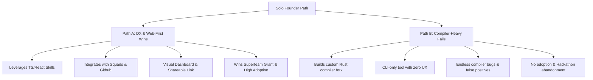
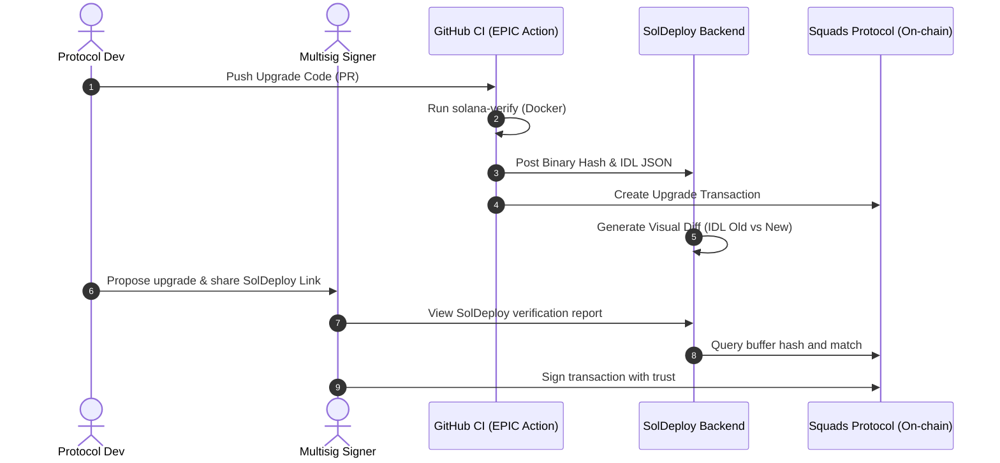

# EPIC (Engineering Platform for Intelligent Contracts): Product Strategy & MVP Roadmap

> **Target Profile**: Solo founder, strong TypeScript/React skills, limited Rust compiler expertise.
> **Core Premise**: Stop building security scanners or Rust AST engines from scratch. Own the **Developer Experience (DX)**, **Integrations**, and **Verification UI** for Solana program deployments.

---

## 1. The Core Strategic Alignment

### Q1: Who is the first real user?
The **Protocol Engineer (Tech Lead / Core Developer)**. 
- **Why?** They are the ones writing the code, running the upgrades, and feeling the anxiety of program upgrades. 
- **Why NOT others?** 
  - *DevOps engineers* in Solana are usually just protocol devs wearing a DevOps hat; they care about speed and safety, not pure infrastructure.
  - *Auditors* do not buy CI/CD tools; they write static reports.
  - *DAO Signers / Founders* are downstream consumers. They want the assurance, but they won't install or configure the tooling. The Protocol Engineer is the gatekeeper.

### Q2: What is the first moment where someone says "I need EPIC"?
The day after a **successful audit** when they need to make "one small change" before launching to mainnet, or right after they push their first **major account structure modification** (e.g., adding a new state field to a user profile account) and realize they have to calculate new space sizes and write migration/realloc code. 
They realize: *"If I get this account padding or realloc size wrong by 1 byte, the program will crash on mainnet and brick all existing user accounts."*

### Q3: What event triggers adoption?
**The first upgrade post-audit (during Mainnet preparation or early mainnet phase).**
- During the first deployment, developers just want to get it live.
- During governance reviews, it's too late to introduce new dev flow.
- The trigger is the **Upgrade Window**. When a developer needs to ship a patch or feature, and they have to convince 3-5 multisig signers (who are not looking at the code daily) that the buffer they uploaded is safe and matches the GitHub PR.

### Q4: If EPIC disappeared tomorrow, who would care?
The **Protocol Engineer** and the **Multisig Signers**. 
- The **Protocol Engineer** would go back to writing custom bash scripts, manual account size calculation spreadsheets, and copy-pasting code diffs into Discord/Telegram to explain upgrades to signers.
- The **Multisig Signers** would return to blind signing transactions on Squads, hoping the buffer account hash matches what the developer claimed.

### Q5: Which feature in the MVP creates the strongest pull?
**The Squads Buffer-to-Commit Verification Diff.**
- The ability to paste a Squads Upgrade Transaction ID (or buffer address) and see:
  1. *"This buffer was verifiably compiled from Github Commit `a1b2c3d`."*
  2. *"Here is the visual diff of the IDL/Account layouts between the current on-chain program and this buffer."*
- This solves the **Trust Gap** between the developer who compiled the code and the signers who approve it.

### Q6: Which feature is unnecessary and should be removed?
**PDA Seed Change Detection / Deep AST Semantic Risk analysis.**
- Tracking PDA seed changes statically in Rust is incredibly hard because seeds are often constructed dynamically using variables, helper functions, or complex expressions. 
- Trying to build this as a solo founder with limited Rust compiler expertise will result in an endless rabbit hole of false positives, compiler panic errors, and zero shipping progress.
- **Remove it.** Focus on IDL/Account layout changes (which are declared in the Anchor IDL and can be parsed purely in TypeScript).

### Q7: What is the smallest possible MVP that still creates value?
A **web dashboard** where a developer inputs a proposed **Squads Buffer Account Address** and a **GitHub PR/Commit Link**. The system:
1. Spawns a GitHub Action or cloud worker to run `solana-verify` (using Docker) on that commit.
2. Checks if the compiled SHA-256 matches the on-chain buffer hash.
3. Parses the generated IDL and compares it to the current on-chain program IDL (which is also stored on-chain or on explorer).
4. Generates a clean, visual web report showing a **Green/Red stability score** and **Account size/field diffs**.

---

## 2. Product Architecture & Focus

### Q8: Is the real product A, B, C, or D?
The real product is **D) SolDeploy Dashboard + B) GitHub Action**.
- The **CLI** is just a utility. Nobody wants another CLI to run locally.
- A **GitHub Action** generates the data automatically on every PR.
- The **SolDeploy Dashboard** is where the value is realized. It's the shareable link that the developer sends to the Squads multisig signers: *"Here is the SolDeploy report proving this buffer matches my PR and has no bricking account changes."*

### Q9: Why would a protocol team switch to EPIC?
| Current State (Manual/Custom) | The EPIC State |
| :--- | :--- |
| **Spreadsheets**: Statically calculating account sizes using `8 + field1_size + field2_size`. | **Automated Validation**: Instant calculation and validation against the actual compiled code. |
| **Trust Me Bro**: Developers compile locally, upload to a buffer, and tell signers: *"This is the code from the PR."* | **Cryptographic Verification**: Verifies the buffer hash matches a clean, Docker-compiled build of the exact GitHub commit. |
| **Blind Signing**: Multisig signers approve an upgrade transaction seeing only a raw buffer public key on Squads. | **Visual Upgrade Intelligence**: Signers click a link on the Squads transaction to see the visual diff of instructions, account shapes, and severities. |

---

## 3. Two Paths: Winning vs. Failing

### Path A: The Winner (Wins Superteam Grant in 4-6 Weeks)
*Focuses on integration, reproducible builds, and the trust bridge between devs and signers.*

*   **Tech Stack**:
    *   **Frontend**: Next.js, Tailwind, Shadcn UI.
    *   **Backend**: TypeScript (Node.js/Bun) + Postgres.
    *   **Worker**: Spawns ephemeral Docker containers (using existing `solana-verify` image) to compile programs reproducibly.
    *   **Parser**: Leverages the Anchor IDL. Instead of parsing Rust AST, it parses the Anchor JSON IDLs from the old and new versions to generate the structural diff. (99% of modern Solana programs are Anchor; this covers the market).
*   **The Workflow**:
    1. Dev opens a PR on GitHub.
    2. EPIC GitHub Action triggers: builds the program using `solana-verify`, uploads the IDL, and generates a preview report.
    3. The Action uploads the program to a buffer account (via Ledger/Keypair or Squads transaction).
    4. EPIC generates a unique **SolDeploy Verification Link** (e.g., `soldeploy.io/verify/marginfi/upgrade-12`).
    5. The developer attaches this link to the Squads multisig proposal.
    6. Signers open the link, see the green checkbox: *"Verified Build from Commit `e3f4b`"*, review the account layout diff, and sign with confidence.
*   **Why it wins**:
    *   It's beautiful. Superteam judges and DAO signers love clean visual interfaces.
    *   It leverages the founder's TS/React skills.
    *   It works out of the box for all Anchor programs without requiring Rust compiler wizardry.

---

### Path B: The Failure (Exciting but Destined to Fail)
*Focuses on writing a low-level Rust static analyzer to catch logical bugs, PDA seed changes, and race conditions.*

*   **Tech Stack**:
    *   Deep Rust, `syn` crate, custom rustc driver compiler plugins.
*   **The Workflow**:
    *   A CLI-only tool that tries to compile the Rust codebase, parse the AST, and trace variables to detect if PDA seeds changed or if there's a missing signer check.
*   **Why it fails**:
    *   **The Compiler Rabbit Hole**: Rust macro expansion, conditional compilation (`#[cfg(...)]`), and external crate dependencies make AST parsing highly fragile. The founder will spend 6 weeks fighting compiler errors and dependency version mismatches.
    *   **Crowded Market**: Sec3, OtterSec, and Scout already have mature static analysis tools. A solo developer cannot compete on static analysis depth.
    *   **No DX Improvement**: It doesn't solve the "blind upgrade signing" problem on Squads. Signers still don't know if the buffer matches the source code.
    *   **Zero Viral Loop**: CLI-only tools lack the shareable, visual loop that dashboards provide.

---

## 4. Immediate MVP Action Plan

To deliver maximum value within 4 weeks:

### Milestone 1 (Week 1-2): The IDL Differentiator
- Build a TypeScript parser that takes two Anchor JSON IDL files (Old and New) and computes:
  - Added / Removed / Reordered accounts.
  - Field type changes (e.g., `u64` to `u128`).
  - Size differences (in bytes) for each account.
  - Added / Removed instruction arguments.
- Build a clean Tailwind UI that renders these changes visually (color-coded, with clear risk labels: `Fatal` for field reordering, `Warning` for size increases without realloc, etc.).

### Milestone 2 (Week 3): Squads & On-Chain Integration
- Integrate with Solana RPC to:
  - Fetch the proposed buffer bytecode hash from the network.
  - Fetch the current on-chain program's IDL.
- Build the **Verify** api: matches the compiled binary hash from the CI build with the on-chain buffer hash.

### Milestone 3 (Week 4): The "Shareable Report" Portal
- Deploy the web dashboard.
- Create a GitHub Action that prints the SolDeploy markdown report directly into the PR comments, containing the link to the visual dashboard.
- Launch the demo video demonstrating the full pipeline on a real Squads transaction.
