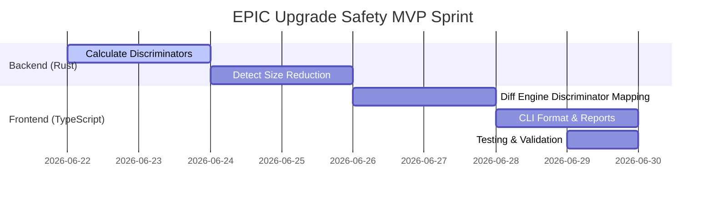

# EPIC Upgrade Safety MVP — Engineering Specification
**Lead Compiler Engineer**  
**Target Demo Date**: June 30, 2026

---

## 1. Objective & Scope

The **Upgrade Safety MVP** is a compiler-level analysis engine designed to prevent breaking Solana program upgrades before code is deployed on-chain. In Solana, smart contracts deserialize flat on-chain account state sequentially (typically using Borsh). Any modification that shifts byte deserialization offsets or alters struct validation discriminators will render existing on-chain data unreadable, permanently corrupting protocol state and locking user funds.

The goal of this MVP is to deliver a **fail-closed static check command** (`epic check <old_program> <new_program>`) that verifies state and interface compatibility at compile time.

---

## 2. Core Detection Mechanics

The MVP compares structural models extracted from the Rust AST of the `old_program` and `new_program`. It targets the following breaking changes:

### A. Field Reordering (CRITICAL)
*   **Definition**: The set of field names is preserved, but their order of appearance inside an account structure is changed.
*   **Threat**: Shift of serialization byte offsets. For example, swapping `pub authority: Pubkey` (32 bytes) and `pub balance: u64` (8 bytes) shifts the offset of `balance` by 24 bytes, resulting in corrupted reads of authority keys as balances.
*   **Detection**: Intersect the fields of $A_{\text{old}}$ and $A_{\text{new}}$ by name. If the relative index sequence differs, raise a `FIELD_REORDERED` finding.

### B. Field Deletion (CRITICAL)
*   **Definition**: A field present in $A_{\text{old}}$ is missing in $A_{\text{new}}$.
*   **Threat**: Shifts all subsequent fields backward, altering the expected account size and corrupting state deserialization.
*   **Detection**: $F_{\text{old}} \setminus F_{\text{new}} \neq \emptyset$. Raise a `FIELD_REMOVED` finding.

### C. Field Type Change (CRITICAL)
*   **Definition**: A field name matches, but its resolved type differs between $A_{\text{old}}$ and $A_{\text{new}}$.
*   **Threat**: Changing types (e.g., `u64` (8 bytes) to `u32` (4 bytes)) shifts all subsequent offsets. Changing custom struct fields alters the recursive width.
*   **Detection**: Query the Type Registry for the size and fingerprint of the type. If `type_old != type_new`, raise a `TYPE_CHANGED` finding.

### D. Account Size Reduction (CRITICAL)
*   **Definition**: The total serialized byte size of the new account struct is less than the old version ($Size_{\text{new}} < Size_{\text{old}}$).
*   **Threat**: Shrinking accounts causes Borsh to succeed but leave trailing bytes on-chain, or fails if the program attempts to reallocate smaller, truncating state or corrupting layouts.
*   **Detection**: Compute Borsh size via AST type expansion:
    $$\Delta Size = Size_{\text{new}} - Size_{\text{old}}$$
    If $\Delta Size < 0$, raise a `SIZE_REDUCED` finding.

### E. Discriminator Changes (CRITICAL)
*   **Definition**: The unique 8-byte serialization prefix of an account or instruction differs.
*   **Threat**: Anchor programs automatically prepend an 8-byte discriminator to identify account types and instruction entrypoints:
    *   **Account Discriminator**: First 8 bytes of `SHA256("account:<StructName>")`
    *   **Instruction Discriminator**: First 8 bytes of `SHA256("global:<FnName>")`
    If a struct or function is renamed, its discriminator changes. The upgraded program will fail to recognize and completely reject existing on-chain state or client instruction calls.
*   **Detection**: 
    1.  Parse structs annotated with `#[account]` and instruction functions inside `#[program]`.
    2.  Calculate the SHA256 discriminators for both versions.
    3.  Flag mismatches (renames, deleted entrypoints) as `DISCRIMINATOR_CHANGED`.

---

## 3. Classification Invariants

Upgrade diagnostics are classified into three severity levels:

| Severity | Definition / Triggering Invariant | Recommended Action |
| :--- | :--- | :--- |
| **SAFE** | • No layout changes, or<br>• Additions strictly at the end of the struct AND accompanied by an explicit `realloc` directive or pre-allocated padding. | Approve and merge PR. |
| **WARNING** | • Appended fields at the end of the struct, but **no** `realloc` directive is defined in the Anchor accounts struct validation.<br>• Account size increases without warning checks. | Require manual review for rent top-ups and state reallocation transactions. |
| **CRITICAL** | • Any instance of: Field Reordering, Field Deletion, Type Change, Size Reduction, or Discriminator Change. | **Fail CI/CD build**. Block deployment. |

---

## 4. Example CLI Outputs

### Scenario 1: Clean/Safe Upgrade (Append field with realloc)
```bash
$ epic check ./programs/vault-v1 ./programs/vault-v2

══════════════════════════════════════════════════════════════════════════
EPIC UPGRADE REPORT: SUCCESS
══════════════════════════════════════════════════════════════════════════
Target Program: Vault
Old Version Path: ./programs/vault-v1
New Version Path: ./programs/vault-v2
Overall Severity: SAFE

[+] Account 'VaultState' modified:
    - Field appended: 'referral_bonus' (Type: u64, Size: 8 bytes)
    - Total Size: 48 -> 56 bytes (+8 bytes)
    - Realloc Check: FOUND (ctx.accounts.vault.realloc at instruction.rs:42)

✅ EPIC Guard Approved: Upgrade is backwards-compatible.
```

### Scenario 2: Breaking Upgrade (Field swap and size shrink)
```bash
$ epic check ./programs/vault-v1 ./programs/vault-v2-broken

══════════════════════════════════════════════════════════════════════════
EPIC UPGRADE REPORT: CRITICAL BLOCKED
══════════════════════════════════════════════════════════════════════════
Target Program: Vault
Old Version Path: ./programs/vault-v1
New Version Path: ./programs/vault-v2-broken
Overall Severity: CRITICAL

❌ [CRITICAL] Account 'VaultState' Layout Shift:
    - Field Reordered: 'authority' (index 1) swapped with 'balance' (index 2).
    - Field Removed: 'metadata_uri' (was at index 3, type: String).
    - Size Reduced: 80 -> 40 bytes (-40 bytes).

❌ [CRITICAL] Program Discriminator Mismatch:
    - Instruction 'withdraw_funds' was renamed to 'withdraw'.
      Old Discriminator: 0x8aef6c2d (global:withdraw_funds)
      New Discriminator: 0xb5d4c9a1 (global:withdraw)
      Impact: Existing client SDKs and CPI callers will fail to execute this instruction.

❌ EPIC Guard Blocked: Upgrade violates ABI stability invariants.
```

---

## 5. Implementation Plan

To meet the **June 30** demo deadline (8 development days), we will execute the following sprint plan:



### Daily Task Breakdown
*   **Day 1-2 (June 22-23)**:
    *   Extend `parser-v2` workspace analyzer to compute SHA256 hashes of structures and entrypoints.
    *   Expose `discriminator` fields in the JSON payload returned by the Rust binary.
*   **Day 3-4 (June 24-25)**:
    *   Add validation check for size shrinking ($Size_{\text{new}} < Size_{\text{old}}$) inside `parser-v2` AST layout engine.
    *   Verify Rust tests pass for size calculations.
*   **Day 5-6 (June 26-27)**:
    *   Update TS `@epic/diff-engine` parser resolver to compare discriminators.
    *   Map discriminator differences and size reductions to `CRITICAL` findings.
*   **Day 7 (June 28)**:
    *   Refine CLI output formats inside `@epic/cli` to produce clean color-coded reports.
    *   Support exit code 1 blocks in `--strict` mode.
*   **Day 8 (June 29)**:
    *   Write edge case fixtures (renamed structs/methods, truncated layouts) and execute local regression checks.
    *   Freeze codebase for June 30 demo.

---

## 6. Engineering Effort Estimate

We estimate the total effort at **16 Engineering Hours** (2 days equivalent):

1.  **Rust Backend Engine Updates** (6 Hours):
    *   SHA256 discriminator generator: 3 Hours
    *   Size shrinkage bounds checks: 3 Hours
2.  **TypeScript Diff Engine Integration** (6 Hours):
    *   JSON schema changes and diff logic: 3 Hours
    *   CLI reporter formatting and terminal styling: 3 Hours
3.  **End-to-End Validation & Fixtures** (4 Hours):
    *   Creating mock broken upgrade states: 2 Hours
    *   Writing integration checks: 2 Hours

---

## 7. Comparative Positioning

Unlike existing solutions, EPIC works at compile-time directly on Rust ASTs to guarantee upgrade safety:

| Dimension | Solana Verify | Anchor Sentinel | EPIC Upgrade Safety MVP |
| :--- | :--- | :--- | :--- |
| **Input Source** | Compiled program binary (.so) vs local build. | Generated Anchor JSON IDL files. | Rust Source Code (AST parser). |
| **Execution Stage** | **Post-deployment** (on-chain verification). | **Post-build** (requires `anchor build`). | **Pre-build** (instant lint / pre-commit). |
| **Detection Method** | Bytecode checksum comparison. | Diffs field objects inside IDL files. | Resolves Rust AST types, layout widths, and control-flow dominance. |
| **Key Limitation** | Cannot tell *why* an upgrade is unsafe, only if the binary changed. | Misses manual structures not exported in IDL, conditional upgrades, and raw Rust modules. | Focuses on static analysis limitations (no runtime solver). |
| **EPIC Advantage** | Unusable during dev sprints. | Easily bypassed if IDL generation fails or structure is not exported. | Runs instantly, requires zero compilation overhead, and checks AST invariants directly. |
