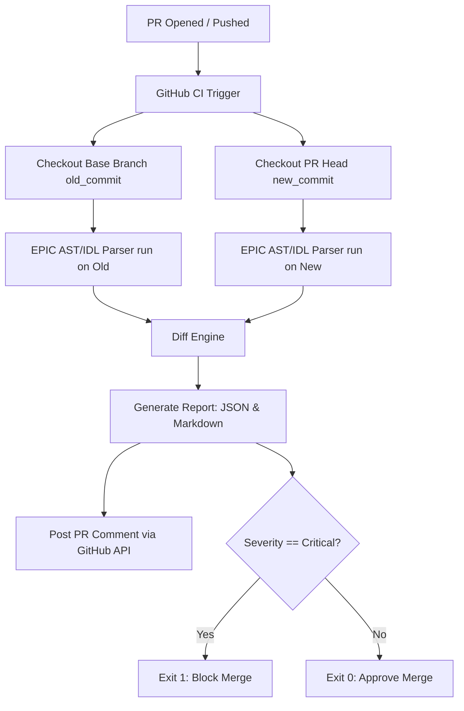

# EPIC: Developer Workflow Productization Plan

This document outlines the strategic and technical roadmap to transform EPIC from a collection of libraries/CLIs into an integrated developer workflow product, focusing exclusively on **GitHub Actions**, **CI/CD gates**, and **Squads multisig integrations** (strictly avoiding SaaS or cloud dashboards).

---

## 1. The GitHub Action Architecture



To achieve high adoption, the GitHub Action must run in **under 15 seconds** and require zero complex toolchain setups:
1.  **Lightweight Source Checkout:** The Action checks out the base branch and the PR branch into separate temporary directories.
2.  **No-Compile AST Analysis:** Rather than running slow BPF builds (`cargo build-sbf` which takes 5-10 minutes), the Action runs the precompiled `parser-v2` Rust binary directly against the raw Rust files. 
3.  **IDL Fallback:** If Rust macro resolution or parsing fails, the Action parses committed IDL JSON files using the TS parser-v2 engine.
4.  **Fail-Closed Gate:** If the calculated severity is `CRITICAL` (e.g. field reordering or type shrinking), the Action exits with status `1`, blocking the PR from merging.

---

## 2. GitHub Action Inputs & Configurations

Protocol teams expect simple configuration blocks in their `.github/workflows/epic.yml` files:

```yaml
name: EPIC Upgrade Guard
on:
  pull_request:
    branches: [ main ]

jobs:
  epic_guard:
    runs-on: ubuntu-latest
    steps:
      - name: Run EPIC Guard
        uses: solana-epic/action@v1
        with:
          github_token: ${{ secrets.GITHUB_TOKEN }}
          program_directory: './programs/my-program'
          fail_on_severity: 'Critical'
          compare_mode: 'ast' # 'ast' (Rust source parsing) or 'idl' (JSON IDL parsing)
```

---

## 3. The Visual Pull Request Comment

Protocol engineers want highly readable, scannable PR comments that look like this:

***

### 🔴 EPIC Upgrade Guard: CRITICAL RISKS DETECTED

An account layout change was detected in this PR that will **brick on-chain state deserialization** for existing accounts if deployed without a state migration.

#### Summary Matrix
| Account Name | Old Size | New Size | Size Delta | Upgrade Severity | Migration Required? |
| :--- | :---: | :---: | :---: | :---: | :---: |
| **UserState** | 120B | 128B | +8B | 🟡 MAJOR | Yes |
| **VaultConfig** | 200B | 200B | 0B | 🔴 CRITICAL | Yes |

<details>
<summary>🔍 Detailed Layout Differences</summary>

#### Account: `UserState`
*   **Field Added:** `rent_collector: publicKey` appended at offset 88.
*   **Risk:** Safe layout shift, but existing accounts must be resized (`realloc`) before writing to this field on-chain.

#### Account: `VaultConfig`
*   **Field Reordered:** `admin` and `authority` swapped offsets.
*   **Risk:** `CRITICAL`. Deserializing existing accounts will result in corrupted memory values (Borsh will read the wrong fields).
</details>

#### 🛠️ Recommended Action Plan
1.  **Block Deployment:** Do not deploy this program version.
2.  **Fix Reordering:** Revert the field reordering in `VaultConfig` so the offsets match the on-chain version.
3.  **Reallocate UserState:** Add `realloc = 8` constraints in your instruction handlers for `UserState`.
4.  **Clients:** Rebuild TS/Rust client SDKs to support the updated layout.

***

## 4. Trust Signals for Protocol Engineers & Signers

### For the Protocol Engineer (The Builder):
*   **Byte-Offset Proofs:** Display the exact byte index changes (e.g., `Field 'admin' moved from offset 8 to 40`).
*   **Borsh Deserialization Analysis:** Detail why a change is incompatible (e.g. `Borsh deserializer will expect 48 bytes but on-chain account has 40 bytes`).
*   **Deterministic Integrity:** The tool must have **zero heuristic/AI modules**. Protocol devs will ignore reports if they have a history of false positives.

### For the Multisig Signer (The Approver):
Signers are not auditing code; they are signing a transaction in a Ledger. They need verification of two things:
1.  **Verification of Source to Bytecode:** A cryptographic assertion that BPF buffer account `BufferX` on-chain was verifiably compiled from Git commit `a1b2c3d` (using `solana-verify` hashes).
2.  **Simple Security Checklist:** A checklist showing that:
    *   No existing state layouts were shifted.
    *   No fields were removed.
    *   No instruction structures were broken.

---

## 5. The Under-1-Week MVP

The smallest possible MVP to ship and validate workflow value:
1.  **Packaged Action Repository:** A composite action (`action.yml`) that runs a Node wrapper script.
2.  **TypeScript IDL Parser Execution:** The wrapper checks out the base branch and the PR branch, parses their committed Anchor IDL JSON files, and generates a diff.
3.  **PR Comment Poster:** The action uses `@actions/github-script` to post the diff table and action plan directly to the PR comments.
4.  **Fail-Closed Gate:** Exits with code `1` if a critical layout change is detected.
*This requires zero compilation overhead, runs in under 5 seconds, and operates entirely in GitHub memory.*

---

## 6. Project Roadmap

*   **v0.6 (CI/CD Hardening):** Case-insensitive pubkey matching, recursive defined type sizes, and multi-program workspace support.
*   **v0.7 (Docker-based Reproducible Builds):** Integrate `solana-verify` into the Action. Automatically compile the program in a hermetic Docker container and post the expected bytecode hash to the PR.
*   **v1.0 (Squads Ledger CLI Bridge):** Ship a CLI tool `epic propose` that:
    1. Compiles the program locally (verifiably).
    2. Uploads the BPF buffer.
    3. Creates the Squads upgrade proposal.
    4. Attaches the EPIC verification report link/markdown directly into the proposal metadata on Squads.

---

## 7. Crucial Failure Modes of the GitHub Action

1.  **Slow CI Execution (Cold Start Compilation):** Compiling Rust source parsers inside a fresh GitHub runner container takes 1-2 minutes.
    *   *Mitigation:* Distribute prebuilt binaries of the CLI in the Action release so execution starts instantly.
2.  **Rust Macro Expansion Limitations:** Statically parsing Rust code without expanding macros (like custom derivatives or `#[account(zero_copy)]`) can miscalculate sizing.
    *   *Mitigation:* Treat IDL-based comparison as the primary source of truth for struct layouts, using AST parsing only for instruction validation.
3.  **Workspace Bloat:** In monorepos containing many Solana programs, parsing paths recursively can fail or take too long.
    *   *Mitigation:* Require the `program_directory` input to target individual programs explicitly.

---

## 8. Real-world Protocol Adoption Strategy

*   **Zero-SaaS Mandate:** Protocols like Drift or Marginfi will never send their compiled binaries or code to a third-party server due to IP and exploit risks. The tool must run **100% locally or in their own GitHub runner**.
*   **The "Zero Noise" Principle:** If the action fails because of a false positive, engineers will disable it immediately.
*   **Integration with Runbooks:** Teams should be able to run `epic check` locally inside their release bash scripts to pre-verify before pushing.

---

## 9. End-to-End Git-to-Squads Workflow

```plaintext
1. Developer pushes a program change to branch `feat/add-field`
   │
   ▼
2. Pull Request is opened to `main` branch
   │
   ▼
3. GitHub CI triggers:
   ├── Checks out base branch (main) and PR branch
   ├── Runs `epic check` on committed IDLs or ASTs
   ├── Runs `solana-verify` in Docker to calculate expected bytecode hash
   └── Posts a layout verification report & bytecode hash to the PR comment
   │
   ▼
4. Team reviews the report:
   ├── If GREEN (Safe/Minor): Merges the PR
   └── If RED (Critical): Blocks merge until layout/realloc is fixed
   │
   ▼
5. Release workflow builds the merged commit, uploads BPF buffer to chain
   │
   ▼
6. Developer triggers `epic propose` CLI:
   ├── Creates Squads upgrade transaction pointing to the uploaded buffer
   └── Embeds the EPIC PR verification hash and layout report into the Squads description
   │
   ▼
7. Multisig Signers open the Squads Proposal:
   ├── Verify the proposed buffer's on-chain bytecode hash matches the EPIC PR hash
   └── Sign and execute the upgrade transaction with confidence
```
