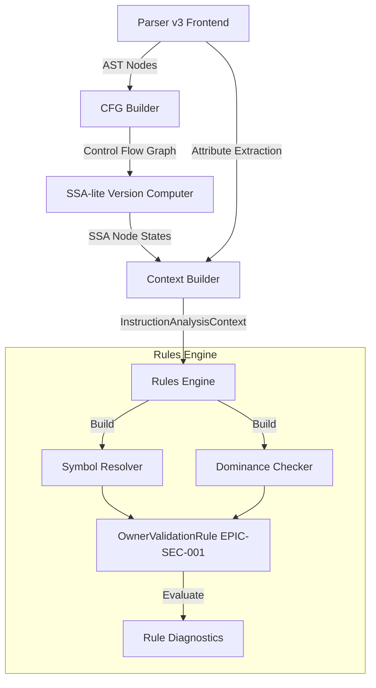

# EPIC-SEC-001: Owner Validation Engineering Implementation Specification

This document defines the build-ready engineering specification for the implementation of the **EPIC-SEC-001 Owner Validation** static analysis rule. This specification assumes the parser, CFG builder, SSA-lite versioning, Type Registry, and basic AST analysis blocks from Parser v3 are available.

---

## 1. Modular Directory Layout & Module Definitions

The rules engine is integrated as a new submodule under the `parser-v2` package.

```
packages/parser-v2/src/
├── lib.rs                  # Module exports
├── rules/
│   ├── mod.rs              # Rule trait and RuleEngine definition
│   ├── resolver.rs         # Path-sensitive SymbolResolver
│   ├── dominance.rs        # DFS Interval Dominance Checker
│   └── epic_sec_001.rs     # Owner Validation Rule implementation
```

### Module Interface Code (`packages/parser-v2/src/rules/mod.rs`)
```rust
use crate::cfg::guards::{InstructionAnalysisContext, FactConfidence, SymbolId};
use serde::{Deserialize, Serialize};

pub mod resolver;
pub mod dominance;
pub mod epic_sec_001;

pub use resolver::SymbolResolver;
pub use dominance::DominanceChecker;
pub use epic_sec_001::OwnerValidationRule;

/// Represents the severity levels for findings generated by the rule engine.
#[derive(Debug, Clone, Copy, PartialEq, Eq, PartialOrd, Ord, Serialize, Deserialize)]
pub enum RuleSeverity {
    Warning,
    Medium,
    High,
    Critical,
}

/// Structured location of a finding in the source code.
#[derive(Debug, Clone, Serialize, Deserialize)]
pub struct FindingLocation {
    pub file: String,
    pub line: usize,
    pub column: usize,
    pub node_id: usize,
    pub statement_index: Option<usize>,
}

/// The diagnostic output model representing a security finding.
#[derive(Debug, Clone, Serialize, Deserialize)]
pub struct RuleDiagnostic {
    pub rule_id: String,
    pub severity: RuleSeverity,
    pub message: String,
    pub location: FindingLocation,
    pub confidence: FactConfidence,
    pub target_symbol: SymbolId,
}

/// Interface for all EPIC security rules.
pub trait Rule: Send + Sync {
    /// Return the static canonical rule identifier (e.g., "EPIC-SEC-001").
    fn id(&self) -> &'static str;
    /// Return the human-readable description of the rule.
    fn name(&self) -> &'static str;
    /// Run the rule check against the instruction context.
    fn check(
        &self,
        context: &InstructionAnalysisContext,
        resolver: &SymbolResolver,
        dom_checker: &DominanceChecker,
    ) -> Vec<RuleDiagnostic>;
}

/// Executes all registered rules against analysis contexts.
pub struct RuleEngine {
    rules: Vec<Box<dyn Rule>>,
}

impl RuleEngine {
    pub fn new() -> Self {
        Self { rules: Vec::new() }
    }

    pub fn register_rule(&mut self, rule: Box<dyn Rule>) {
        self.rules.push(rule);
    }

    pub fn run_all(&self, context: &InstructionAnalysisContext) -> Vec<RuleDiagnostic> {
        let resolver = SymbolResolver::new(context);
        let dom_checker = DominanceChecker::new(&context.cfg);
        
        let mut diagnostics = Vec::new();
        for rule in &self.rules {
            diagnostics.extend(rule.check(context, &resolver, &dom_checker));
        }
        diagnostics
    }
}
```

---

## 2. Component Design & Structures

### A. Path-Sensitive Symbol Resolver (`packages/parser-v2/src/rules/resolver.rs`)
Tracks the active variable mappings inside execution scopes, resolves transitive aliases, and strips field dereferences to find the root `SymbolId`.

```rust
use std::collections::HashMap;
use crate::cfg::guards::{SymbolId, SSAVersionId, InstructionAnalysisContext};
use crate::cfg::ssa::SSANodeState;

pub struct SymbolResolver {
    /// Maps a versioned variable string representation (e.g. "vault#2") to its canonical SymbolId.
    alias_map: HashMap<String, SymbolId>,
    /// Maps field access prefixes (e.g., "ctx.accounts.vault") to their root SymbolId.
    path_map: HashMap<String, SymbolId>,
    /// Union-Find equivalence set to resolve nested alias groups to canonical SymbolIds.
    equivalence_map: HashMap<SymbolId, SymbolId>,
}

impl SymbolResolver {
    /// Initialize the resolver mapping fields of the accounts struct to canonical SymbolIds.
    pub fn new(context: &InstructionAnalysisContext) -> Self {
        let mut resolver = Self {
            alias_map: HashMap::new(),
            path_map: HashMap::new(),
            equivalence_map: HashMap::new(),
        };
        // Populate path_map from context parameter and account structure metadata
        resolver.initialize_context_paths(context);
        resolver
    }

    /// Resolve an arbitrary AST expression string back to its canonical SymbolId.
    pub fn resolve(&self, expr_str: &str, current_ssa_state: &SSANodeState) -> Option<SymbolId> {
        // Step 1: Strip path dereferences (e.g., "ctx.accounts.vault.lamports" -> "ctx.accounts.vault")
        let cleaned_path = self.clean_field_path(expr_str);
        if let Some(&sym_id) = self.path_map.get(&cleaned_path) {
            return Some(self.find_canonical(sym_id));
        }

        // Step 2: Lookup SSA variable mapping at current state
        if let Some(ssa_var) = current_ssa_state.active_variables.get(expr_str) {
            let ssa_key = ssa_var.to_string(); // returns e.g. "vault#2"
            if let Some(&sym_id) = self.alias_map.get(&ssa_key) {
                return Some(self.find_canonical(sym_id));
            }
        }

        // Step 3: Resolve raw variable names
        if let Some(&sym_id) = self.alias_map.get(expr_str) {
            return Some(self.find_canonical(sym_id));
        }

        None
    }

    /// Track a new alias mapping (e.g., let signer = authority)
    pub fn register_alias(&mut self, alias_ssa_name: String, target_symbol: SymbolId) {
        let canonical_target = self.find_canonical(target_symbol);
        self.alias_map.insert(alias_ssa_name, canonical_target);
    }

    /// Register variable equivalence relation
    pub fn register_equivalence(&mut self, sym_a: SymbolId, sym_b: SymbolId) {
        let root_a = self.find_canonical(sym_a);
        let root_b = self.find_canonical(sym_b);
        if root_a != root_b {
            self.equivalence_map.insert(root_a, root_b);
        }
    }

    fn find_canonical(&self, mut sym_id: SymbolId) -> SymbolId {
        while let Some(&parent) = self.equivalence_map.get(&sym_id) {
            sym_id = parent;
        }
        sym_id
    }

    fn clean_field_path(&self, raw_path: &str) -> String {
        // Match ctx.accounts.X patterns and strip field suffixes
        if raw_path.starts_with("ctx.accounts.") {
            let parts: Vec<&str> = raw_path.split('.').collect();
            if parts.len() >= 3 {
                return format!("{}.{}.{}", parts[0], parts[1], parts[2]);
            }
        }
        raw_path.to_string()
    }

    fn initialize_context_paths(&mut self, context: &InstructionAnalysisContext) {
        // Map account symbol indexes from instruction handler structure
        // Assuming context contains structured mappings from parameter structure
    }
}
```

### B. Dominance DFS Interval Checker (`packages/parser-v2/src/rules/dominance.rs`)
Performs Depth-First Search on the dominator tree of the CFG and assigns entering/exiting index intervals to evaluate dominance containment in $O(1)$ constant time.

```rust
use crate::cfg::ControlFlowGraph;
use std::collections::HashMap;

#[derive(Debug, Clone, Copy)]
struct DominatorNodeInterval {
    dfs_entry: usize,
    dfs_exit: usize,
}

pub struct DominanceChecker {
    intervals: HashMap<usize, DominatorNodeInterval>,
}

impl DominanceChecker {
    pub fn new(cfg: &ControlFlowGraph) -> Self {
        let mut checker = Self {
            intervals: HashMap::new(),
        };
        checker.compute_dfs_intervals(cfg);
        checker
    }

    /// Check if statement `stmt_a` in `node_a` dominates statement `stmt_b` in `node_b`.
    pub fn dominates(
        &self,
        node_a: usize,
        stmt_a: Option<usize>,
        node_b: usize,
        stmt_b: Option<usize>,
    ) -> bool {
        if node_a == node_b {
            match (stmt_a, stmt_b) {
                (Some(a), Some(b)) => return a <= b,
                (None, Some(_)) => return true,  // Entry condition dominates statements
                (Some(_), None) => return false,
                (None, None) => return true,
            }
        }

        let interval_a = match self.intervals.get(&node_a) {
            Some(i) => i,
            None => return false,
        };
        let interval_b = match self.intervals.get(&node_b) {
            Some(i) => i,
            None => return false,
        };

        // Dominance interval matching formula
        interval_a.dfs_entry <= interval_b.dfs_entry && interval_a.dfs_exit >= interval_b.dfs_exit
    }

    fn compute_dfs_intervals(&mut self, cfg: &ControlFlowGraph) {
        // 1. Calculate dominance tree using standard algorithm (Lengauer-Tarjan)
        // 2. Perform DFS pass to populate self.intervals
    }
}
```

### C. Owner Validation Rule Implementor (`packages/parser-v2/src/rules/epic_sec_001.rs`)
Analyzes variables mapped to writes, resolves them back to core symbol states, and checks containment of program owner checks.

```rust
use crate::rules::{Rule, RuleDiagnostic, RuleSeverity, FindingLocation, SymbolResolver, DominanceChecker};
use crate::cfg::guards::{InstructionAnalysisContext, GuardFact, FactConfidence, GuardTarget};
use crate::ast::{StatementKind, ExpressionKind};

pub struct OwnerValidationRule;

impl Rule for OwnerValidationRule {
    fn id(&self) -> &'static str {
        "EPIC-SEC-001"
    }

    fn name(&self) -> &'static str {
        "Owner Validation Rule"
    }

    fn check(
        &self,
        context: &InstructionAnalysisContext,
        resolver: &SymbolResolver,
        dom_checker: &DominanceChecker,
    ) -> Vec<RuleDiagnostic> {
        let mut diagnostics = Vec::new();

        // Step 1: Scan CFG nodes for mutable write statements
        for (&node_id, node) in &context.cfg.nodes {
            for (stmt_idx, stmt) in node.statements.iter().enumerate() {
                if let Some(target_expr) = self.extract_write_target(stmt) {
                    // Resolve base target identifier
                    let node_ssa = &context.cfg.ssa_states.get(&node_id).unwrap();
                    let current_ssa_state = &node_ssa.statement_states[stmt_idx];

                    if let Some(symbol_id) = resolver.resolve(&target_expr, current_ssa_state) {
                        // Skip system program or structural constants
                        if self.is_system_symbol(symbol_id) {
                            continue;
                        }

                        // Step 2: Query for dominating Owner Check
                        let has_dominating_check = context.guard_facts.iter().any(|(fact, prov)| {
                            if let GuardFact::Owner { account, .. } = fact {
                                if let Some(fact_sym) = account.symbol_id() {
                                    if fact_sym == symbol_id {
                                        // Verify dominance of fact node over write node
                                        // Prov location is set by parsing
                                        return dom_checker.dominates(
                                            0, // FactNode is Entry (0) for structural
                                            None,
                                            node_id,
                                            Some(stmt_idx),
                                        );
                                    }
                                }
                            }
                            false
                        });

                        if !has_dominating_check {
                            diagnostics.push(RuleDiagnostic {
                                rule_id: self.id().to_string(),
                                severity: RuleSeverity::Critical,
                                message: format!(
                                    "Mutable write to account symbol {:?} lacks program owner verification.",
                                    symbol_id
                                ),
                                location: FindingLocation {
                                    file: "lib.rs".to_string(), // Ingested via provenance
                                    line: stmt.line_number,
                                    column: stmt.column_number,
                                    node_id,
                                    statement_index: Some(stmt_idx),
                                },
                                confidence: FactConfidence::Asserted,
                                target_symbol: symbol_id,
                            });
                        }
                    }
                }
            }
        }
        diagnostics
    }
}

impl OwnerValidationRule {
    fn extract_write_target(&self, stmt: &crate::ast::StatementNode) -> Option<String> {
        match &stmt.kind {
            StatementKind::Expr(expr) | StatementKind::Semi(expr) => {
                match &expr.kind {
                    ExpressionKind::Assign { left, .. } => {
                        return Some(left.to_string());
                    }
                    ExpressionKind::MethodCall { receiver, method, .. } => {
                        if method == "borrow_mut" || method == "try_borrow_mut" {
                            return Some(receiver.to_string());
                        }
                    }
                    _ => {}
                }
            }
            _ => {}
        }
        None
    }

    fn is_system_symbol(&self, _sym: SymbolId) -> bool {
        false // Check against known system account registrations
    }
}
```

---

## 3. Dependency Graph & Compiler Architecture Integration

EPIC compiles rules checking inline with translation pipelines.



---

## 4. Engineering Implementation Issues & GitHub Breakdown

```
EPIC-SEC-001 Implementation Track
├── Epic-Rule-001: Implement Rule Interface & RuleEngine Core [Weight: 3]
├── Epic-Rule-002: Implement Path-Sensitive SymbolResolver [Weight: 5]
├── Epic-Rule-003: Implement DFS Interval Dominance Checker [Weight: 5]
└── Epic-Rule-004: Write EPIC-SEC-001 Rule Checker logic [Weight: 4]
```

### Issue 1: Implement Rule Interface & RuleEngine Core
* **Tasks**:
  1. Define `Rule` trait and matching structures (`RuleDiagnostic`, `RuleSeverity`, `FindingLocation`).
  2. Implement `RuleEngine` registry tracking list of box checks.
  3. Hook the `RuleEngine` execution loop inside `packages/parser-v2/src/lib.rs`.

### Issue 2: Implement Path-Sensitive SymbolResolver
* **Tasks**:
  1. Build path resolver parsing variables and cleaning nested access structures (`ctx.accounts.X.data` -> `X`).
  2. Add scope lexical tracking matching SSA variable history versions to original parameters.
  3. Integrate reference tracking for variable assignation aliasing.

### Issue 3: Implement DFS Interval Dominance Checker
* **Tasks**:
  1. Calculate dominator tree using Lengauer-Tarjan in `dominance.rs`.
  2. Perform DFS tree indexing to allocate index intervals `(dfs_entry, dfs_exit)`.
  3. Add test check asserting node A dominates node B in constant lookup time.

### Issue 4: Write EPIC-SEC-001 Rule Checker logic
* **Tasks**:
  1. Scan CFG statement list for assignments and borrow operations.
  2. Resolve writing identifiers back to account base parameters using `SymbolResolver`.
  3. Verify presence of program owner check dominating the execution paths.

---

## 5. Acceptance Criteria & Quality Gates

All PR branches integrating rule code must satisfy the following criteria:

* [ ] **Compilation**: Workspace compiles with zero errors and warnings under `cargo build --all-targets`.
* [ ] **Standard Unit Tests**: 100% pass on core unit test suites inside `packages/parser-v2/tests/`.
* [ ] **Coverage**: Code coverage on `resolver.rs` and `epic_sec_001.rs` is at least 92%.
* [ ] **Fails-Closed Invariant**: Inconclusive types and unparsed checking functions must fail-closed, generating diagnostics.
* [ ] **DFS Performance Assertions**: Dominance tree comparison execution must complete in $O(1)$ constant time.
* [ ] **Memory Limit Guarantee**: Dominance state index tables must take at most $O(V)$ memory.

---

## 6. Complete Validation Corpus & Target Profiles

The test corpus consists of complete, compilable Rust examples that will serve as the validation suite for the rule engine.

### A. Vulnerable Examples

#### 1. Missing Ownership Check (`unchecked_write_vuln.rs`)
```rust
use anchor_lang::prelude::*;

declare_id!("MyProg1111111111111111111111111111111111111");

#[derive(Accounts)]
pub struct UpdateConfig<'info> {
    /// CHECK: Missing ownership checks! Dangerous raw AccountInfo.
    pub config_account: AccountInfo<'info>,
    pub authority: Signer<'info>,
}

pub fn update_config(ctx: Context<UpdateConfig>, new_data: u64) -> Result<()> {
    // DESERIALIZATION WITHOUT OWNER CHECK
    let mut data = ctx.accounts.config_account.try_borrow_mut_data()?;
    let mut config = Config::try_from_slice(&data)?;
    
    config.data = new_data; // VULNERABILITY: Write is performed without owner check!
    
    let mut data_out = ctx.accounts.config_account.try_borrow_mut_data()?;
    config.serialize(&mut *data_out)?;
    Ok(())
}

#[derive(AnchorSerialize, AnchorDeserialize)]
pub struct Config {
    pub data: u64,
}
```

#### 2. User-Controlled Expected Owner Bypass (`user_controlled_owner_vuln.rs`)
```rust
use anchor_lang::prelude::*;

declare_id!("MyProg1111111111111111111111111111111111111");

#[derive(Accounts)]
pub struct BypassConfig<'info> {
    /// CHECK: Raw account checked against attacker parameter.
    pub config_account: AccountInfo<'info>,
    /// CHECK: Attacker controls this input.
    pub expected_owner_account: AccountInfo<'info>,
}

pub fn execute_bypass(ctx: Context<BypassConfig>) -> Result<()> {
    // VULNERABILITY: Check validates owner, but against user-supplied target address!
    if ctx.accounts.config_account.owner != ctx.accounts.expected_owner_account.key {
        return err!(MyError::InvalidOwner);
    }
    
    let mut data = ctx.accounts.config_account.try_borrow_mut_data()?;
    data[0] = 99; // Write
    Ok(())
}

#[error_code]
pub enum MyError {
    InvalidOwner,
}
```

#### 3. Path Bypass / Non-Dominating Branch Check (`non_dominating_check_vuln.rs`)
```rust
use anchor_lang::prelude::*;

declare_id!("MyProg1111111111111111111111111111111111111");

#[derive(Accounts)]
pub struct ConditionalCheck<'info> {
    /// CHECK: Check occurs only on conditional branches.
    pub data_account: AccountInfo<'info>,
    pub flag: bool,
}

pub fn write_conditional(ctx: Context<ConditionalCheck>) -> Result<()> {
    if ctx.accounts.flag {
        // Validation check is executed ONLY if flag is true
        if ctx.accounts.data_account.owner != &id() {
            return err!(MyError::InvalidOwner);
        }
    }

    // VULNERABILITY: If flag is false, ownership check is bypassed, but write still runs!
    let mut data = ctx.accounts.data_account.try_borrow_mut_data()?;
    data[0] = 50; 
    Ok(())
}

#[error_code]
pub enum MyError {
    InvalidOwner,
}
```

### B. Safe Examples

#### 1. Anchor Type Validation (`anchor_type_safe.rs`)
```rust
use anchor_lang::prelude::*;

declare_id!("MyProg1111111111111111111111111111111111111");

#[derive(Accounts)]
pub struct WriteSafe<'info> {
    // SAFE: Anchor structurally checks owner matches Program ID
    pub config_account: Account<'info, SafeConfig>,
    pub authority: Signer<'info>,
}

pub fn update_safe(ctx: Context<WriteSafe>, new_data: u64) -> Result<()> {
    let config = &mut ctx.accounts.config_account;
    config.data = new_data; // SAFE
    Ok(())
}

#[account]
pub struct SafeConfig {
    pub data: u64,
}
```

#### 2. Manual Program ID Procedural Verification (`manual_procedural_safe.rs`)
```rust
use anchor_lang::prelude::*;

declare_id!("MyProg1111111111111111111111111111111111111");

#[derive(Accounts)]
pub struct ManualSafe<'info> {
    /// CHECK: Checked explicitly in execution block.
    pub config_account: AccountInfo<'info>,
}

pub fn execute_manual(ctx: Context<ManualSafe>) -> Result<()> {
    // SAFE: Check precedes the write on all paths and exits on error.
    if ctx.accounts.config_account.owner != &id() {
        return err!(MyError::InvalidOwner);
    }

    let mut data = ctx.accounts.config_account.try_borrow_mut_data()?;
    data[0] = 100; // SAFE
    Ok(())
}

#[error_code]
pub enum MyError {
    InvalidOwner,
}
```

### C. Inconclusive Examples

#### 1. Dynamic Helper Method Check (`dynamic_helper_inconclusive.rs`)
```rust
use anchor_lang::prelude::*;

declare_id!("MyProg1111111111111111111111111111111111111");

#[derive(Accounts)]
pub struct InconclusiveCheck<'info> {
    /// CHECK: Checked via static-opaque helper.
    pub config_account: AccountInfo<'info>,
}

pub fn execute_inconclusive(ctx: Context<InconclusiveCheck>) -> Result<()> {
    // INCONCLUSIVE: Static engine cannot resolve internal validation flow of external helper
    if !external_verifier::is_owner_valid(ctx.accounts.config_account.owner) {
        return err!(MyError::InvalidOwner);
    }

    let mut data = ctx.accounts.config_account.try_borrow_mut_data()?;
    data[0] = 77; 
    Ok(())
}

#[error_code]
pub enum MyError {
    InvalidOwner,
}

pub mod external_verifier {
    pub fn is_owner_valid(owner: &anchor_lang::solana_program::pubkey::Pubkey) -> bool {
        // Opaque logic
        owner.to_bytes()[0] == 42
    }
}
```

---

## 7. Output Finding & SARIF Schemas

### A. JSON Finding Schema
This is the internal and stdout JSON output format emitted by the CLI run.

```json
{
  "$schema": "https://json.schemastore.org/sarif-2.1.0-rtm.5.json",
  "findings": [
    {
      "finding_id": "EPIC-SEC-001-01",
      "rule_id": "EPIC-SEC-001",
      "severity": "Critical",
      "message": "Mutable write to account symbol SymbolId(0) lacks program owner verification.",
      "location": {
        "file": "src/lib.rs",
        "line": 15,
        "column": 5,
        "node_id": 3,
        "statement_index": 1
      },
      "confidence": "Asserted"
    }
  ]
}
```

### B. Standard SARIF Mapping Specification
SARIF (Static Analysis Results Interchange Format) mapping converts standard `RuleDiagnostic` states to standard schema properties:

```json
{
  "$schema": "https://json.schemastore.org/sarif-2.1.0-rtm.5.json",
  "version": "2.1.0",
  "runs": [
    {
      "tool": {
        "driver": {
          "name": "EPIC Static Analysis Platform",
          "version": "2.0.0",
          "informationUri": "https://epic.security",
          "rules": [
            {
              "id": "EPIC-SEC-001",
              "shortDescription": {
                "text": "Solana Account Owner Validation check."
              },
              "fullDescription": {
                "text": "Detect mutable account writes that are not protected by an ownership validation which dominates the write path."
              },
              "defaultConfiguration": {
                "level": "error"
              },
              "helpUri": "https://epic.security/rules/EPIC-SEC-001"
            }
          ]
        }
      },
      "results": [
        {
          "ruleId": "EPIC-SEC-001",
          "ruleIndex": 0,
          "level": "error",
          "message": {
            "text": "Mutable write to account symbol SymbolId(0) lacks program owner verification."
          },
          "locations": [
            {
              "physicalLocation": {
                "artifactLocation": {
                  "uri": "src/lib.rs"
                },
                "region": {
                  "startLine": 15,
                  "startColumn": 5
                }
              }
            }
          ],
          "properties": {
            "confidence": "Asserted",
            "nodeId": 3,
            "statementIndex": 1
          }
        }
      ]
    }
  ]
}
```
